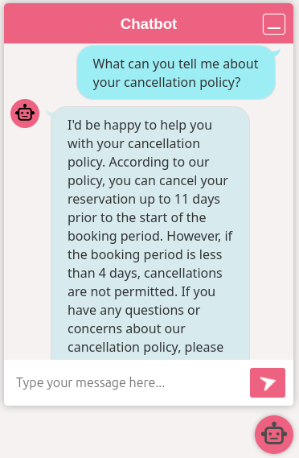

# Step 10 - Serving the model in pure Java with Jlama

So far we relied on OpenAI to serve the LLM that we used to build our application, but the quarkus-langchain4j integration makes it straightforward to integrate any other service provider. For instance we could serve our model on our local machine through an [Ollama](https://ollama.com/) server. Even better we may want to serve it in Java and directly embedded in our Quarkus application without the need of querying an external service through REST calls. In this step we will see how to make this possible through [Jlama](https://github.com/tjake/Jlama).

## Introducing Jlama

Jlama is a library allowing to execute LLM inference in pure Java. It supports many LLM model families like Llama, Mistral, Qwen2 and Granite. It also implements out-of-the-box many useful LLM related features like functions calling, models quantization, mixture of experts and even distributed inference.

The final code of this step is available in the `step-10` directory.

## Adding Jlama dependencies

Jlama is well integrated with Quarkus through the dedicated langchain4j based extension. Note that for performance reasons Jlama uses the [Vector API](https://openjdk.org/jeps/469) which is still in preview in Java 23, and very likely will be released as a supported feature in Java 25.

For this reason the first step to do is enabling the `quarkus-maven-plugin` in our pom file to use this preview API, by adding the following configuration to it.

```xml title="pom.xml"
<configuration>
    <jvmArgs>--enable-preview --enable-native-access=ALL-UNNAMED</jvmArgs>
    <modules>
        <module>jdk.incubator.vector</module>
    </modules>
</configuration>
```

We also need to add the `os-maven-plugin` extension under the `build` section in our pom file.

```xml title="pom.xml"
<extensions>
    <extension>
        <groupId>kr.motd.maven</groupId>
        <artifactId>os-maven-plugin</artifactId>
        <version>1.7.1</version>
    </extension>
</extensions>
```

Then in the same file we must add the necessary dependencies to Jlama and the corresponding quarkus-langchain4j extension. This extension has to be used as an alternative to the openai one, so we could move that dependency in a profile (active by default) and put the Jlama ones into a different profile.

```xml title="pom.xml"
<profiles>
    <profile>
        <id>openai</id>
        <activation>
            <activeByDefault>true</activeByDefault>
            <property>
                <name>openai</name>
            </property>
        </activation>
        <dependencies>
            <dependency>
                <groupId>io.quarkiverse.langchain4j</groupId>
                <artifactId>quarkus-langchain4j-openai</artifactId>
                <version>${quarkus-langchain4j.version}</version>
            </dependency>
        </dependencies>
    </profile>
    <profile>
        <id>jlama</id>
        <activation>
            <property>
                <name>jlama</name>
            </property>
        </activation>
        <dependencies>
            <dependency>
                <groupId>io.quarkiverse.langchain4j</groupId>
                <artifactId>quarkus-langchain4j-jlama</artifactId>
                <version>${quarkus-langchain4j.version}</version>
            </dependency>
            <dependency>
                <groupId>com.github.tjake</groupId>
                <artifactId>jlama-core</artifactId>
                <version>${jlama.version}</version>
            </dependency>
            <dependency>
                <groupId>com.github.tjake</groupId>
                <artifactId>jlama-native</artifactId>
                <version>${jlama.version}</version>
                <classifier>${os.detected.classifier}</classifier>
            </dependency>
        </dependencies>
    </profile>
</profiles>
```

## Configuring Jlama

After having added the required dependencies it is now only necessary to configure the LLM served by Jlama adding the following entries to the `application.properties` file.

```properties
quarkus.langchain4j.jlama.chat-model.model-name=tjake/Llama-3.2-1B-Instruct-JQ4
quarkus.langchain4j.jlama.chat-model.temperature=0
quarkus.langchain4j.jlama.log-requests=true
quarkus.langchain4j.jlama.log-responses=true
```

Here we configured a relatively small model taken from the Huggingface repository of the Jlama main maintainer, but you can choose any other model. When the application is compiled for the first time the model is automatically downloaded locally by Jlama from Huggingface.

## Running the LLM inference locally

Now we can go back again to our chatbot and test the RAG pattern as we did in the step 05, but this time running the LLM inference engine directly embedded in our Java application and without using any external services. Open the browser at [http://localhost:8080](http://localhost:8080){target="_blank"} and ask a question related to the cancellation policy.

```
What can you tell me about your cancellation policy?
```

Note that it might take a bit longer than ChatGPT to answer the question.

