# Workshop Environment

## Attend **2640** Lab - **Tuesday, Oct 7th | 04:15 pm - 05:45 pm EDT**

<span style="color:red;">**Note: 2641 lab students should skip this step!!!**</span>

Open a new Chrome browser on your Windows desktop. The homepage will take you to the [IBM TechZone](https://techzone.ibm.com/){target="_blank"} website. From there, log in with your email credential. 

Go to `My Events`, select `Tuesday`, and enter `Lab 2640` in the search box to open the lab.


Select `Open this lab`. You should now be in the lab information page.

!!! tip
    You can also access the lab information page directly from the [Lab 2640 website](https://ibm.biz/BdeU6n){target="_blank"}.

Copy the `access code` and select `Attend` to open the lab.

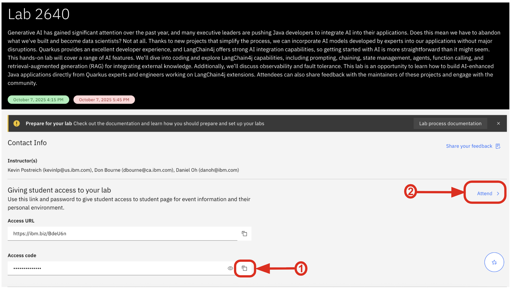

Paste the `access code` and select `Validate access code`.


Once you validate the access code, select `Access lab`.


Note that it might take a few minutes to fetch your lab environment.

You should see that your lab workspace with your student number (e.g., `Student 1`) is now running.


Scroll down to the bottom of the page and check the status (e.g., `Running`) of the lab. Select `Console` to access your workspace (virtual machine).


A new window will open in which you can access the workspace.


## Attend **2641** Lab - **Wednesday, Oct 8th | 02:00 pm - 03:30 pm EDT**

<span style="color:red;">**Note: 2640 lab students should skip this step!!!**</span>

Open a new Chrome browser on your Windows desktop. The homepage will take you to the [IBM TechZone](https://techzone.ibm.com/){target="_blank"} website. From there, log in with your email credential. 

Go to `My Events`, select `Wednesday`, and enter `Lab 2641` in the search box to open the lab.

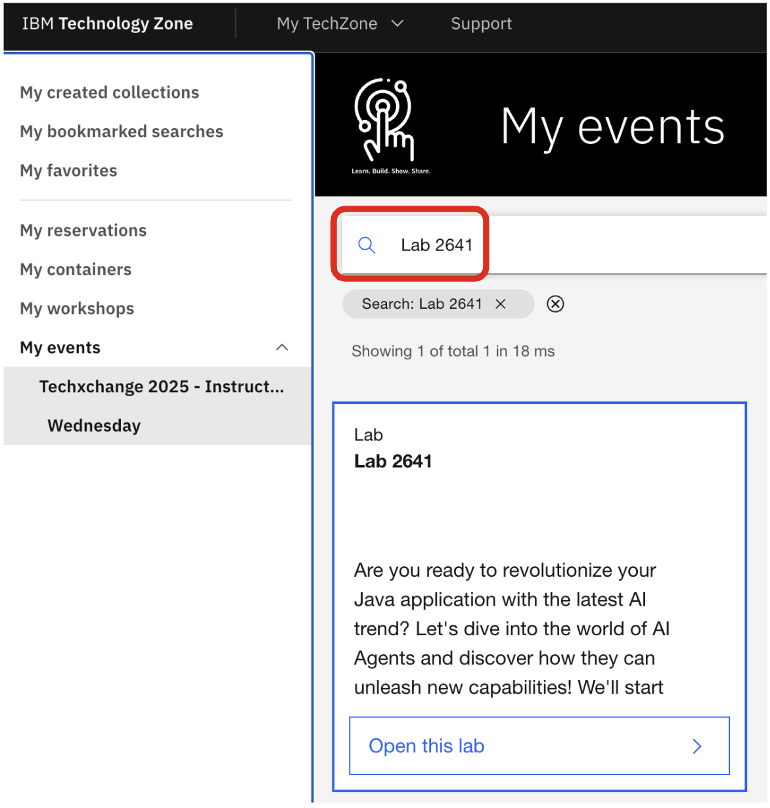

Select `Open this lab`. You should now be in the lab information page.

!!! tip
    You can also access the lab information page directly from the [Lab 2641 website](https://ibm.biz/Bde9pY){target="_blank"}.

Copy the `access code` and select `Attend` to open the lab.

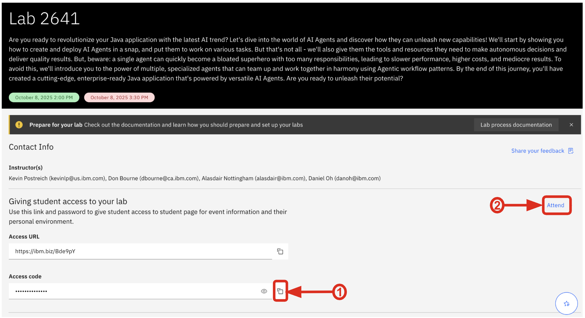 

Paste the `access code` and select `Validate access code`.


Once you validate the access code, select `Access lab`.


Note that it might take a few minutes to fetch your lab environment.

You should see that your lab workspace with your student number (e.g., `Student 1`) is now running.

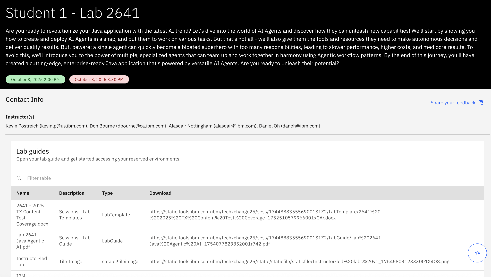

Scroll down to the bottom of the page and check the status (e.g., `Running`) of the lab. Select `Console` to access your workspace (virtual machine).


A new window will open in which you can access the workspace.


## Exploring the workspace

Login to the workspace using the `admin` credentials provided by your instructor. 

The password is `IBMDem0s`. **Copy it**!

### Copy & Paste Text from Local to Workspace

To copy text from your local machine to the workspace:

 1) Select `Send Text` icon on the top of the workspace. 
 2) `Paste` the password the text panel (e.g., `Ctrl + V`). 
 3) Focus the password textbox and select `Fast Send Text`. The password will be pasted automatically to the textbox.
 4) Enter!

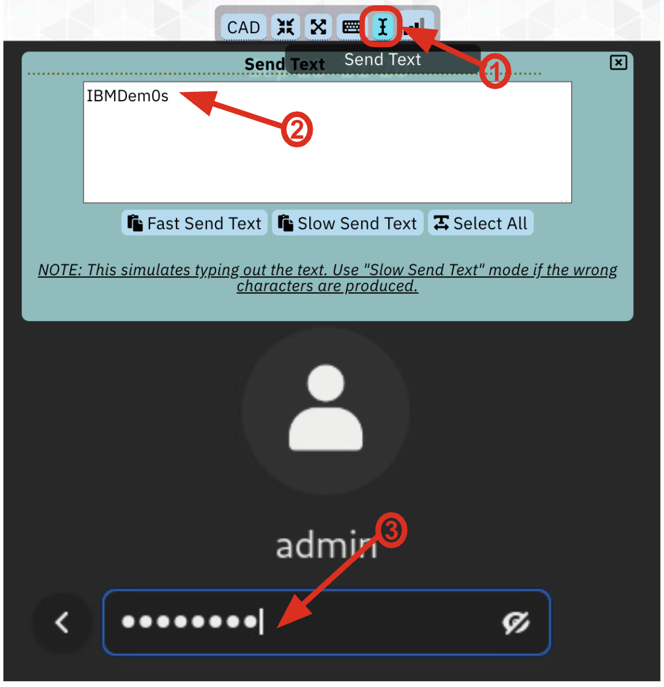

You should see the Red Hat Enterprise Linux (RHEL) GUI console.

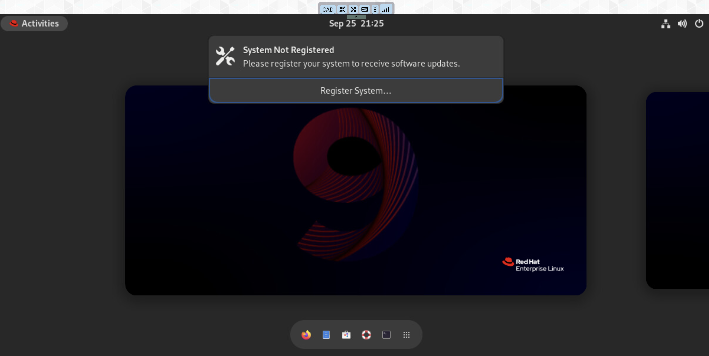

Close the **System Not Registered** warning.

### Clone the workshop repository

Open the terminal in the RHEL console via `Activities > Terminal`.

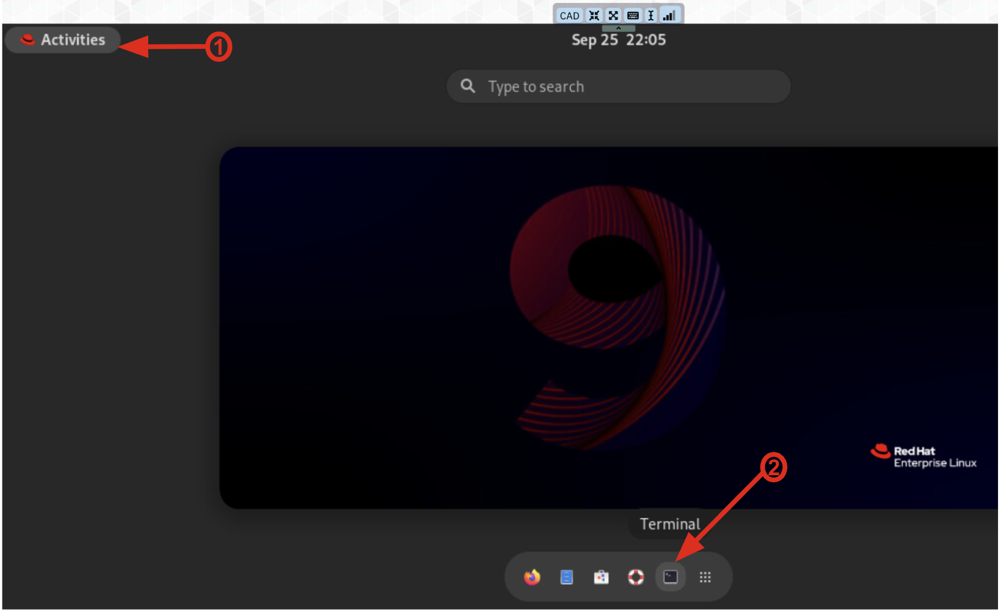

Using the `Send Text`, run the following Git command to clone the repository.

```bash
git clone https://github.com/danieloh30/quarkus-workshop-langchain4j.git
```

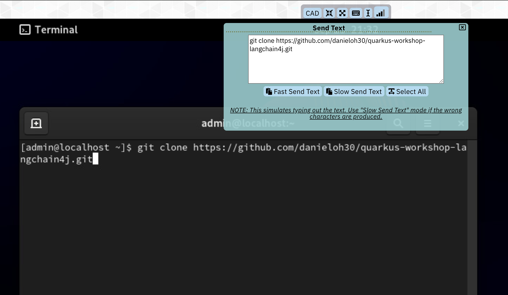

Enter!

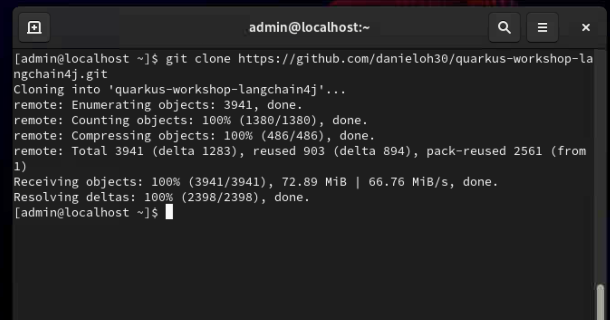

You should see the repository cloned in the `quarkus-workshop-langchain4j` directory.

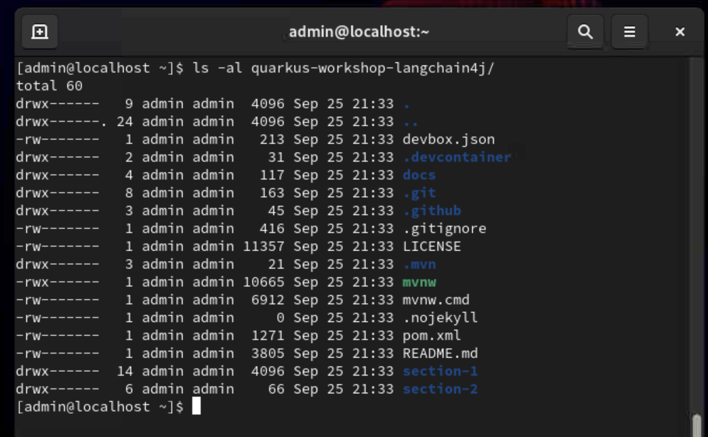

### Open the project in your IDE (Visual Studio Code)

Run the following command in the RHEL terminal to open the project in your IDE.

```bash
code quarkus-workshop-langchain4j
```

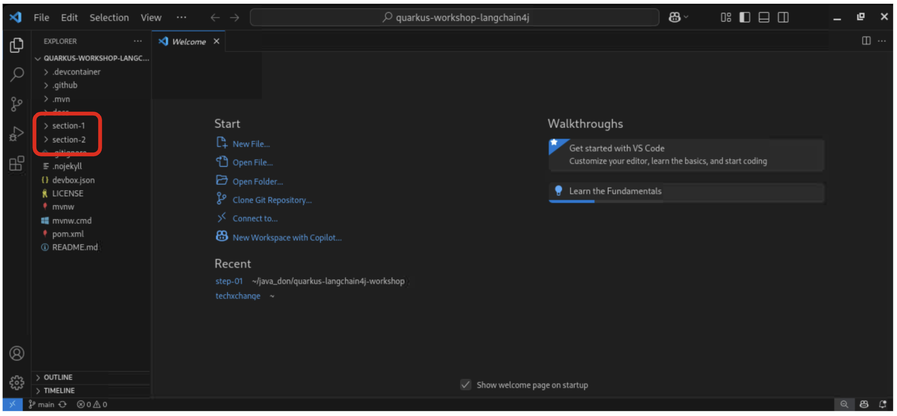

You should see the project opened in your IDE. You can navigate to the `section-1` or `section-2` directory.

### Export the Open AI API key

Run the following command in the VS Code terminal (`Terminal > Open New Terminal`) to export the Open AI API key.

Note that you should replace `<your-open-ai-api-key>` with your actual Open AI API key that the instructor provided.

```bash
export OPENAI_API_KEY=<your-open-ai-api-key>
```

Make sure to run the Quarkus dev mode (`./mvnw quarkus:dev`) in this terminal later that you export the API key.

### Open the lab instructions

Open a new Firefox application on the RHEL console via `Activities > Firefox`.

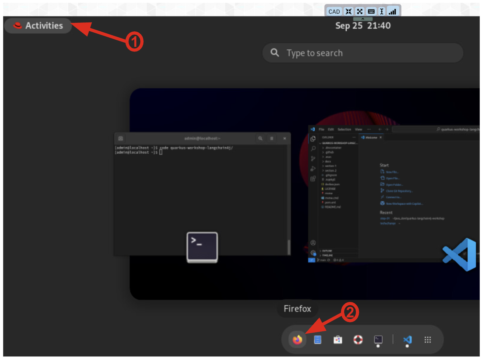

Type `bit.ly/quarkus-ai-labs` in the address bar.

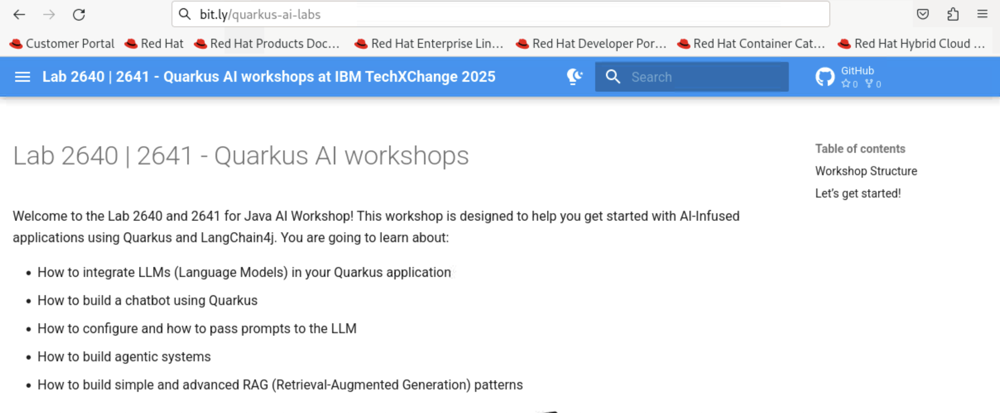

Unfold the lab instructions menu.

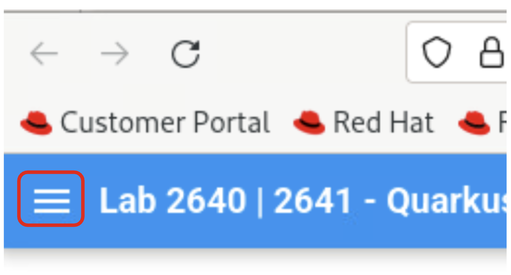

Select the `Section 1 - Generative AI Apps` or `Section 2 - Agentic AI Workflows` lab instructions.

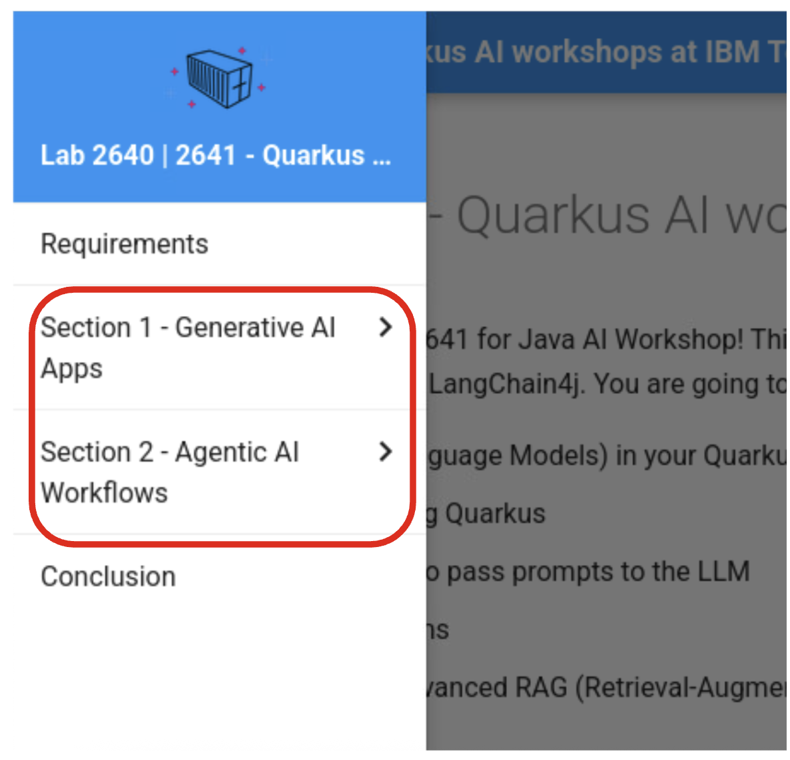

**Lets start the lab!**